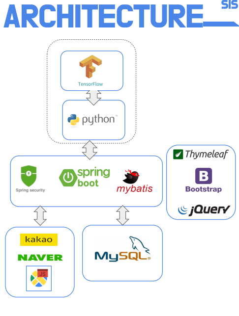

### Shop In Shop

* 4차인재양성과정 중 (한국생산기술연구소) 6개월 프로젝트에 대한 설명입니다.
    
* 기획의도
    - 딥러닝 기반의 상권분석 및 Shop In Shop 중개 서비스
* Shop In Shop이란?
    - 매장 안 다른 매장을 만드어 상품을 판매하는 새로운 형태의 매장입니다.
* 특징
    
  
* 프로젝트 구성도
     